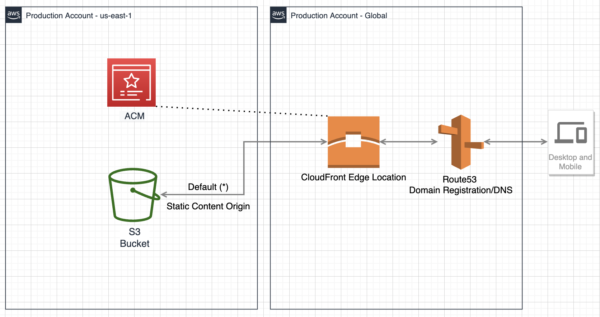
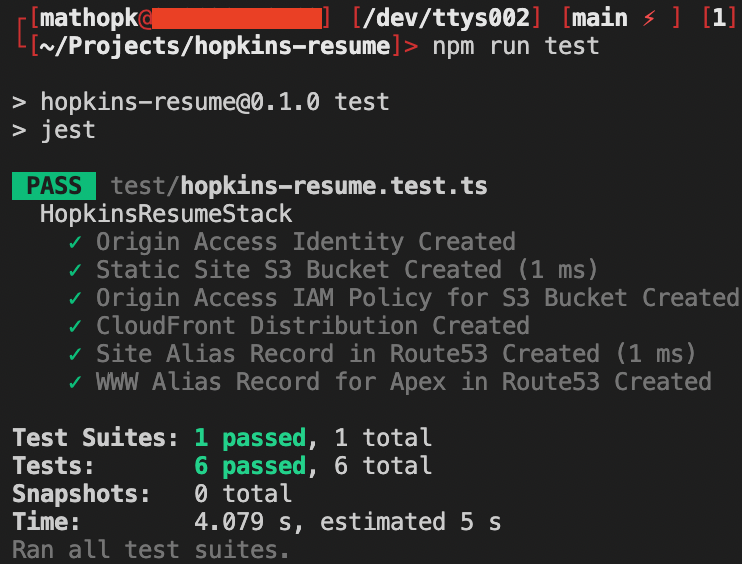

# Hopkins Resume (https://HopkinsResu.me) - AWS CDK

This repo allows for repeatedly deploying *Matt Hopkins' Resume Website* with no manual steps in AWS. The site leverages CloudFront's global distributed network of edge locations for high availability and performance. Due to being entirely serverless and leveraging free tiers the project costs only pennies a month. 

## Architecture Diagram


## Getting started

### Setup
Install or update the [AWS CDK CLI](https://github.com/aws/aws-cdk) from npm (requires [Node.js ≥ 14.15.0](https://nodejs.org/download/release/latest-v14.x/)). 


```bash
npm i -g aws-cdk
```

Clone this repo locally.

```bash
$ git clone https://github.com/moebaca/hopkins-resume.git
$ cd hopkins-resume
```

Now install our NPM dependencies

```bash
$ npm install
```

### Bootstrap CDK environment

Before you deploy the application you need to make sure the environment
where you are planning to deploy the site to has been bootstrapped,
specifically with the newest version of the bootstrapping stack. 

You will need to bootstrap every environment you plan to deploy the CDK
application to, which in this example is a single account. 

You only need to do this one time per environment where you want to deploy
CDK applications. If you are unsure whether your environment has been
bootstrapped already, you can always run the command again. 

Make sure you have credentials for the account and run the following
command. Since we are only bootstrapping a single environment, we don't
need to specify the environment in the bootstrap command. The CLI will
know whih environment to bootstrap based on your .aws/credentials file
(assuming a Unix-like environment as I have not tested this on Windows).

```bash
$ cdk bootstrap --cloudformation-execution-policies arn:aws:iam::aws:policy/AdministratorAccess
```

### Run unit tests
To ensure a consistent experience intended by the developer ensure all tests are passing before deploying. 

Run the below command:
```bash
$ npm run test
```

Output should look similar to this though the number and description of test cases may vary (SS taken 4/28/2022):


### Deploy

You should now have met all the conditions to safely deploy the project to your AWS account (note you must register and own the hopkinsresu.me domain in Route53 in the same account in order for this to work as it is hard coded. Run the below command with the required parameters.
- accountId = The account id needs to be explicitly passed as a parameter as a requirement for hosted-zone lookups

```bash
$ cdk deploy -c accountId=1234567890
```

### Tear down

```bash
$ cdk destroy accountId=1234567890
```
