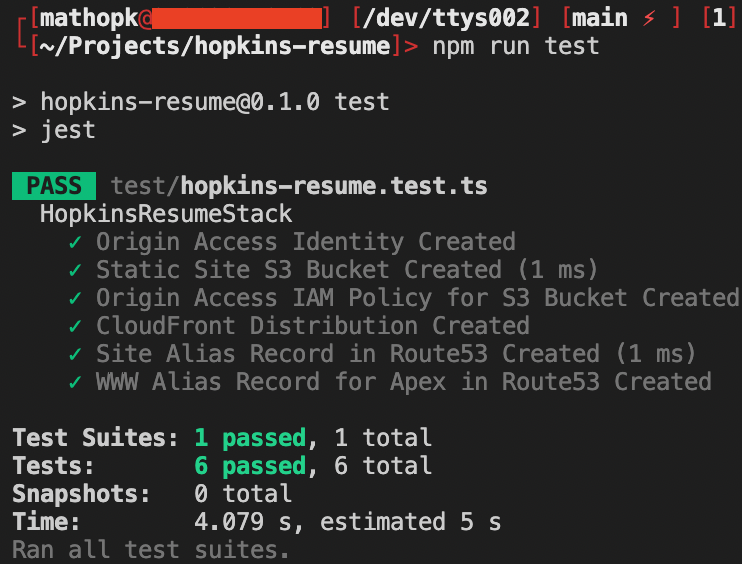

# Hopkins Resume (https://HopkinsResu.me) - AWS CDK

This repo allows for repeatedly deploying *Matt Hopkins' Resume Website* in AWS. The site leverages CloudFront's global distributed network of edge locations for high availability and performance. Due to being entirely serverless and leveraging free tier the project costs only pennies a month. 

## Architecture Diagram


## Features

- **Fully Serverless Architecture**: S3, CloudFront, and Route53 for high availability
- **Infrastructure as Code**: AWS CDK for repeatable, version-controlled infrastructure
- **CI/CD Pipeline**: GitHub Actions for automated testing and deployment
- **Cost Optimization**: Leverages AWS free tier resources
- **Code Quality**: Linting, formatting, and testing integrated

## Getting started

### Setup
Install or update the [AWS CDK CLI](https://github.com/aws/aws-cdk) from npm (requires [Node.js ≥ 16.x](https://nodejs.org/download/release/latest-v16.x/)). 

```bash
npm i -g aws-cdk
```

Clone this repo locally.

```bash
git clone https://github.com/moebaca/hopkins-resume.git

cd hopkins-resume
```

Now install our NPM dependencies

```bash
npm install
```

### Local Development

You can preview the site locally using VS Code's Live Server or any static file server:

```bash
npx http-server site-contents
```

The site is designed to work both locally and when deployed to CloudFront with automatic path resolution.

### Linting and Formatting

The project includes ESLint, HTMLHint, and Prettier for code quality:

```bash
npm run format
npm run lint

# Run all checks (lint, format verification, tests)
npm run ci
```

### Bootstrap CDK environment

Before you deploy the application you need to make sure the environment
where you are planning to deploy the site to has been bootstrapped,
specifically with the newest version of the bootstrapping stack. 

You will need to bootstrap every environment you plan to deploy the CDK
application to, which in this example is a single account. 

You only need to do this one time per environment where you want to deploy
CDK applications. If you are unsure whether your environment has been
bootstrapped already, you can always run the command again. 

Make sure you have credentials for the account and run the following
command. Since we are only bootstrapping a single environment, we don't
need to specify the environment in the bootstrap command. The CLI will
know which environment to bootstrap based on your .aws/credentials file
(assuming a Unix-like environment as I have not tested this on Windows).

```bash
cdk bootstrap --cloudformation-execution-policies arn:aws:iam::aws:policy/AdministratorAccess
```

### Run unit tests
To ensure a consistent experience intended by the developer ensure all tests are passing before deploying. 

Run the below command:
```bash
npm run test
```

Output should look similar to this though the number and description of test cases may vary:


### Deploy

You should now have met all the conditions to safely deploy the project to your AWS account (note you must register and own the hopkinsresu.me domain in Route53 in the same account in order for this to work as it is hard coded). Run the below command with the required parameters.
- accountId = The account id needs to be explicitly passed as a parameter as a requirement for hosted-zone lookups

```bash
$ cdk deploy -c accountId=1234567890
```

### Tear down

```bash
$ cdk destroy -c accountId=1234567890
```

## CI/CD Pipeline

This project uses GitHub Actions for continuous integration:

- **Automatic Linting**: JavaScript and HTML files are checked for issues
- **Code Formatting**: All files are verified to follow consistent style
- **CDK Synthesis**: Infrastructure code is validated by synthesizing CloudFormation templates

When you push to main or create a pull request, the CI workflow will automatically run these checks.

## Customization

To use this for your own resume:

1. Register your own domain in Route53
2. Update the `domainName` variable in `lib/hopkins-resume-stack.ts`
3. Replace the content in `site-contents/` with your own resume
4. Deploy using the instructions above

## License

MIT